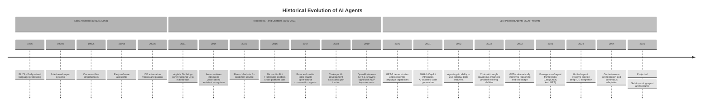

```mermaid
%%{init: {'theme': 'base', 'themeVariables': { 'primaryColor': '#f4f4f4', 'primaryTextColor': '#333', 'primaryBorderColor': '#ccc', 'lineColor': '#555', 'secondaryColor': '#f0f0f0', 'tertiaryColor': '#fff' }}}%%
timeline
    title Historical Evolution of AI Agents
    
    section Early Assistants (1960s-2000s)
        1966 : ELIZA - Early natural language processing
        1970s : Rule-based expert systems
        1980s : Command-line scripting tools
        1990s : Early software assistants
        2000s : IDE automation macros and plugins
    
    section Modern NLP and Chatbots (2010-2019)
        2011 : Apple's Siri brings conversational UI to mainstream
        2014 : Amazon Alexa introduces voice-based assistant ecosystem
        2015 : Rise of chatbots for customer service
        2016 : Microsoft's Bot Framework enables cross-platform bots
        2017 : Rasa and similar tools enable open-source conversation agents
        2018 : Task-specific development assistants gain traction
        2019 : OpenAI releases GPT-2, showing significant NLP improvements
    
    section LLM-Powered Agents (2020-Present)
        2020 : GPT-3 demonstrates unprecedented language capabilities
        2021 : GitHub Copilot introduces AI-assisted code generation
        2022 : Agents gain ability to use external tools and APIs
        2022 : Chain-of-thought reasoning enhances problem-solving abilities
        2023 : GPT-4 dramatically improves reasoning and tool usage
        2023 : Emergence of agent frameworks (LangChain, AutoGPT)
        2024 : Unified agentic systems provide deep IDE integration
        2024 : Context-aware orchestration and continuous adaptation
        2025 : Projected: Self-improving agent architectures
``` 