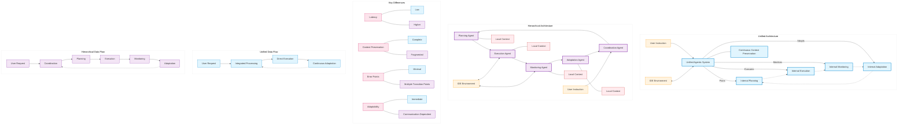

```mermaid
%%{init: {'theme': 'base', 'themeVariables': { 'primaryColor': '#f5f5f5', 'primaryTextColor': '#333', 'primaryBorderColor': '#ccc', 'lineColor': '#555', 'secondaryColor': '#f0f0f0', 'tertiaryColor': '#fff' }}}%%
graph TB
    subgraph "Unified Architecture"
        UA[Unified Agentic System]
        UA -->|Plans| UA1[Internal Planning]
        UA -->|Executes| UA2[Internal Execution]
        UA -->|Monitors| UA3[Internal Monitoring]
        UA -->|Adapts| UA4[Internal Adaptation]
        
        UI[User Instruction] --> UA
        IDE[IDE Environment] <--> UA
        
        UA1 -.-> UA2
        UA2 -.-> UA3
        UA3 -.-> UA4
        UA4 -.-> UA1
        
        UAC[Continuous Context Preservation]
        UA --- UAC
        
        classDef unified fill:#e1f5fe,stroke:#0288d1,stroke-width:2px;
        classDef flow fill:#e8f5e9,stroke:#388e3c,stroke-width:1px;
        classDef env fill:#fff3e0,stroke:#ff9800,stroke-width:1px;
        
        class UA,UA1,UA2,UA3,UA4,UAC unified;
        class UI,IDE env;
    end
    
    subgraph "Hierarchical Architecture"
        PA[Planning Agent]
        EA[Execution Agent]
        MA[Monitoring Agent]
        AA[Adaptation Agent]
        CA[Coordination Agent]
        
        UI2[User Instruction] --> CA
        IDE2[IDE Environment] <--> EA
        IDE2 <--> MA
        
        CA --> PA
        PA --> EA
        EA --> MA
        MA --> AA
        AA --> CA
        
        CTX1[Local Context]
        CTX2[Local Context]
        CTX3[Local Context]
        CTX4[Local Context]
        
        PA --- CTX1
        EA --- CTX2
        MA --- CTX3
        AA --- CTX4
        
        classDef hierarchical fill:#f3e5f5,stroke:#7b1fa2,stroke-width:2px;
        classDef context fill:#ffebee,stroke:#c62828,stroke-width:1px;
        classDef env fill:#fff3e0,stroke:#ff9800,stroke-width:1px;
        
        class PA,EA,MA,AA,CA hierarchical;
        class CTX1,CTX2,CTX3,CTX4 context;
        class UI2,IDE2 env;
    end
    
    %% Comparison Elements
    subgraph "Key Differences"
        D1[Latency]
        D2[Context Preservation]
        D3[Error Points]
        D4[Adaptability]
        
        D1 --- D1U[Low]
        D1 --- D1H[Higher]
        
        D2 --- D2U[Complete]
        D2 --- D2H[Fragmented]
        
        D3 --- D3U[Minimal]
        D3 --- D3H[Multiple Transition Points]
        
        D4 --- D4U[Immediate]
        D4 --- D4H[Communication Dependent]
        
        classDef diff fill:#fce4ec,stroke:#d81b60,stroke-width:1px;
        classDef unified_trait fill:#e1f5fe,stroke:#0288d1,stroke-width:1px;
        classDef hier_trait fill:#f3e5f5,stroke:#7b1fa2,stroke-width:1px;
        
        class D1,D2,D3,D4 diff;
        class D1U,D2U,D3U,D4U unified_trait;
        class D1H,D2H,D3H,D4H hier_trait;
    end
    
    %% Data Flow Examples
    subgraph "Unified Data Flow"
        UDF1[User Request] --> UDF2[Integrated Processing] --> UDF3[Direct Execution] --> UDF4[Continuous Adaptation]
        UDF4 -.-> UDF2
        
        classDef uflow fill:#e1f5fe,stroke:#0288d1,stroke-width:1px;
        class UDF1,UDF2,UDF3,UDF4 uflow;
    end
    
    subgraph "Hierarchical Data Flow"
        HDF1[User Request] --> HDF2[Coordination] --> HDF3[Planning] --> HDF4[Execution] --> HDF5[Monitoring] --> HDF6[Adaptation]
        HDF6 -.-> HDF2
        
        classDef hflow fill:#f3e5f5,stroke:#7b1fa2,stroke-width:1px;
        class HDF1,HDF2,HDF3,HDF4,HDF5,HDF6 hflow;
    end
``` 