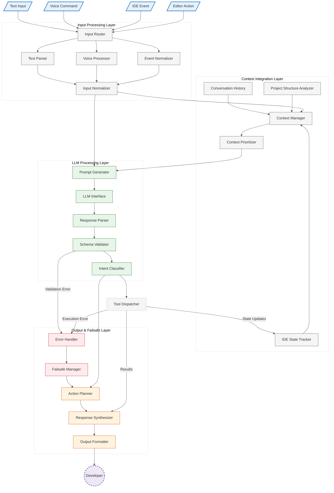

```mermaid
%%{init: {'theme': 'base', 'themeVariables': { 'primaryColor': '#f5f5f5', 'primaryTextColor': '#333', 'primaryBorderColor': '#ccc', 'lineColor': '#555', 'secondaryColor': '#f0f0f0', 'tertiaryColor': '#fff' }}}%%
flowchart TB
    %% Main Entry Points
    UserText[/"Text Input"/]
    UserVoice[/"Voice Command"/]
    IDEEvent[/"IDE Event"/]
    EditorAction[/"Editor Action"/]
    
    %% Input Processing Section
    subgraph "Input Processing Layer"
        InputRouter["Input Router"]
        TextParser["Text Parser"]
        VoiceProcessor["Voice Processor"]
        EventNormalizer["Event Normalizer"]
        InputNormalizer["Input Normalizer"]
        
        %% Internal connections
        InputRouter --> TextParser
        InputRouter --> VoiceProcessor
        InputRouter --> EventNormalizer
        TextParser --> InputNormalizer
        VoiceProcessor --> InputNormalizer
        EventNormalizer --> InputNormalizer
    end
    
    %% Context Management Section
    subgraph "Context Integration Layer"
        ContextManager["Context Manager"]
        IDEStateTracker["IDE State Tracker"]
        HistoryManager["Conversation History"]
        ProjectAnalyzer["Project Structure Analyzer"]
        ContextPrioritizer["Context Prioritizer"]
        
        %% Internal connections
        IDEStateTracker --> ContextManager
        HistoryManager --> ContextManager
        ProjectAnalyzer --> ContextManager
        ContextManager --> ContextPrioritizer
    end
    
    %% LLM Processing Section
    subgraph "LLM Processing Layer"
        PromptGenerator["Prompt Generator"]
        LLMInterface["LLM Interface"]
        ResponseParser["Response Parser"]
        SchemaValidator["Schema Validator"]
        IntentClassifier["Intent Classifier"]
        
        %% Internal connections
        PromptGenerator --> LLMInterface
        LLMInterface --> ResponseParser
        ResponseParser --> SchemaValidator
        SchemaValidator --> IntentClassifier
    end
    
    %% Output & Failsafe Section
    subgraph "Output & Failsafe Layer"
        OutputFormatter["Output Formatter"]
        ErrorHandler["Error Handler"]
        FailsafeManager["Failsafe Manager"]
        ActionPlanner["Action Planner"]
        ResponseSynthesizer["Response Synthesizer"]
        
        %% Internal connections
        ActionPlanner --> ResponseSynthesizer
        ResponseSynthesizer --> OutputFormatter
        ErrorHandler --> FailsafeManager
        FailsafeManager --> ActionPlanner
    end
    
    %% Tool System Interface
    ToolDispatcher["Tool Dispatcher"]
    
    %% External Connections
    
    %% Input connections
    UserText --> InputRouter
    UserVoice --> InputRouter
    IDEEvent --> InputRouter
    EditorAction --> InputRouter
    
    %% Layer connections
    InputNormalizer --> ContextManager
    InputNormalizer --> PromptGenerator
    ContextPrioritizer --> PromptGenerator
    IntentClassifier --> ActionPlanner
    IntentClassifier --> ToolDispatcher
    OutputFormatter --> User
    
    %% Error paths
    SchemaValidator -- "Validation Error" --> ErrorHandler
    ToolDispatcher -- "Execution Error" --> ErrorHandler
    
    %% Feedback loops
    ToolDispatcher -- "Results" --> ResponseSynthesizer
    ToolDispatcher -- "State Updates" --> IDEStateTracker
    
    %% Output destination
    User(("Developer"))
    
    %% Styling
    classDef input fill:#e3f2fd,stroke:#1565c0,stroke-width:2px;
    classDef process fill:#f5f5f5,stroke:#616161,stroke-width:1px;
    classDef llm fill:#e8f5e9,stroke:#2e7d32,stroke-width:1px;
    classDef output fill:#fff3e0,stroke:#e65100,stroke-width:1px;
    classDef error fill:#ffebee,stroke:#c62828,stroke-width:1px;
    classDef user fill:#ede7f6,stroke:#4527a0,stroke-width:2px,stroke-dasharray: 5 5;
    
    class UserText,UserVoice,IDEEvent,EditorAction input;
    class InputRouter,TextParser,VoiceProcessor,EventNormalizer,InputNormalizer,ContextManager,IDEStateTracker,HistoryManager,ProjectAnalyzer,ContextPrioritizer process;
    class PromptGenerator,LLMInterface,ResponseParser,SchemaValidator,IntentClassifier llm;
    class OutputFormatter,ResponseSynthesizer,ActionPlanner output;
    class ErrorHandler,FailsafeManager error;
    class User user;
``` 