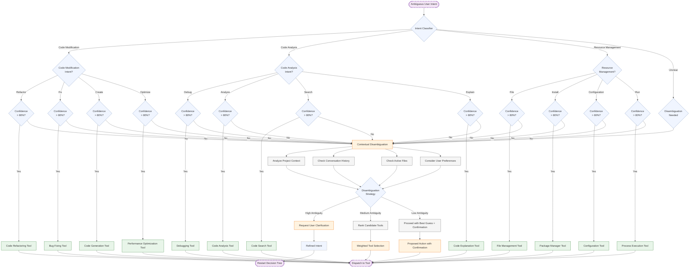

```mermaid
%%{init: {'theme': 'base', 'themeVariables': { 'primaryColor': '#f0f5ff', 'primaryTextColor': '#333', 'primaryBorderColor': '#aaa', 'lineColor': '#555', 'secondaryColor': '#f4f4f4', 'tertiaryColor': '#fff' }}}%%
flowchart TB
    start([Ambiguous User Intent])

    %% First Level - Initial Intent Classification
    start --> intentClassifier{Intent Classifier}
    
    %% Second Level - Primary Intent Types
    intentClassifier -->|"Code Modification"| codeModification{"Code Modification\nIntent?"}
    intentClassifier -->|"Code Analysis"| codeAnalysis{"Code Analysis\nIntent?"}
    intentClassifier -->|"Resource Management"| resourceMgmt{"Resource\nManagement?"}
    intentClassifier -->|"Unclear"| disambiguationNeeded{Disambiguation\nNeeded}
    
    %% Code Modification Branch
    codeModification -->|"Refactor"| refactorConfidence{Confidence\n> 80%?}
    codeModification -->|"Fix"| fixConfidence{Confidence\n> 80%?}
    codeModification -->|"Create"| createConfidence{Confidence\n> 80%?}
    codeModification -->|"Optimize"| optimizeConfidence{Confidence\n> 80%?}
    
    %% Code Analysis Branch
    codeAnalysis -->|"Debug"| debugConfidence{Confidence\n> 80%?}
    codeAnalysis -->|"Analyze"| analyzeConfidence{Confidence\n> 80%?}
    codeAnalysis -->|"Search"| searchConfidence{Confidence\n> 80%?}
    codeAnalysis -->|"Explain"| explainConfidence{Confidence\n> 80%?}
    
    %% Resource Management Branch
    resourceMgmt -->|"File"| fileConfidence{Confidence\n> 80%?}
    resourceMgmt -->|"Install"| installConfidence{Confidence\n> 80%?}
    resourceMgmt -->|"Configuration"| configConfidence{Confidence\n> 80%?}
    resourceMgmt -->|"Run"| runConfidence{Confidence\n> 80%?}
    
    %% High Confidence Outcomes - Code Modification
    refactorConfidence -->|"Yes"| refactorTool[Code Refactoring Tool]
    fixConfidence -->|"Yes"| fixTool[Bug Fixing Tool]
    createConfidence -->|"Yes"| createTool[Code Generation Tool]
    optimizeConfidence -->|"Yes"| optimizeTool[Performance Optimization Tool]
    
    %% High Confidence Outcomes - Code Analysis
    debugConfidence -->|"Yes"| debugTool[Debugging Tool]
    analyzeConfidence -->|"Yes"| analyzeTool[Code Analysis Tool]
    searchConfidence -->|"Yes"| searchTool[Code Search Tool]
    explainConfidence -->|"Yes"| explainTool[Code Explanation Tool]
    
    %% High Confidence Outcomes - Resource Management
    fileConfidence -->|"Yes"| fileTool[File Management Tool]
    installConfidence -->|"Yes"| installTool[Package Manager Tool]
    configConfidence -->|"Yes"| configTool[Configuration Tool]
    runConfidence -->|"Yes"| runTool[Process Execution Tool]
    
    %% Low Confidence and Disambiguation Outcomes
    refactorConfidence -->|"No"| contextualDisambiguation
    fixConfidence -->|"No"| contextualDisambiguation
    createConfidence -->|"No"| contextualDisambiguation
    optimizeConfidence -->|"No"| contextualDisambiguation
    
    debugConfidence -->|"No"| contextualDisambiguation
    analyzeConfidence -->|"No"| contextualDisambiguation
    searchConfidence -->|"No"| contextualDisambiguation
    explainConfidence -->|"No"| contextualDisambiguation
    
    fileConfidence -->|"No"| contextualDisambiguation
    installConfidence -->|"No"| contextualDisambiguation
    configConfidence -->|"No"| contextualDisambiguation
    runConfidence -->|"No"| contextualDisambiguation
    
    disambiguationNeeded --> contextualDisambiguation[Contextual Disambiguation]
    
    %% Contextual Disambiguation Methods
    contextualDisambiguation --> projectContext[Analyze Project Context]
    contextualDisambiguation --> conversationHistory[Check Conversation History]
    contextualDisambiguation --> activeFiles[Check Active Files]
    contextualDisambiguation --> userProfile[Consider User Preferences]
    
    %% Disambiguation Strategies
    projectContext --> strategySelector{Disambiguation\nStrategy}
    conversationHistory --> strategySelector
    activeFiles --> strategySelector
    userProfile --> strategySelector
    
    strategySelector -->|"High Ambiguity"| userClarification[Request User Clarification]
    strategySelector -->|"Medium Ambiguity"| candidateRanking[Rank Candidate Tools]
    strategySelector -->|"Low Ambiguity"| bestGuess[Proceed with Best Guess + Confirmation]
    
    %% Final Outcomes
    userClarification --> refinedIntent[Refined Intent]
    candidateRanking --> weightedSelection[Weighted Tool Selection]
    bestGuess --> proposedAction[Proposed Action with Confirmation]
    
    refinedIntent --> restart([Restart Decision Tree])
    weightedSelection --> toolDispatch([Dispatch to Tool])
    proposedAction --> toolDispatch
    
    %% Terminal Nodes
    refactorTool --> toolDispatch
    fixTool --> toolDispatch
    createTool --> toolDispatch
    optimizeTool --> toolDispatch
    
    debugTool --> toolDispatch
    analyzeTool --> toolDispatch
    searchTool --> toolDispatch
    explainTool --> toolDispatch
    
    fileTool --> toolDispatch
    installTool --> toolDispatch
    configTool --> toolDispatch
    runTool --> toolDispatch
    
    %% Style Definitions
    classDef decision fill:#f0f5ff,stroke:#5b7db1,stroke-width:1px;
    classDef tool fill:#e8f5e9,stroke:#2e7d32,stroke-width:1px;
    classDef process fill:#f5f5f5,stroke:#616161,stroke-width:1px;
    classDef disambiguation fill:#fff3e0,stroke:#ef6c00,stroke-width:1px;
    classDef terminal fill:#f3e5f5,stroke:#6a1b9a,stroke-width:1px,stroke-dasharray: 5 5;
    
    %% Apply Styles
    class intentClassifier,codeModification,codeAnalysis,resourceMgmt,disambiguationNeeded,refactorConfidence,fixConfidence,createConfidence,optimizeConfidence,debugConfidence,analyzeConfidence,searchConfidence,explainConfidence,fileConfidence,installConfidence,configConfidence,runConfidence,strategySelector decision;
    
    class refactorTool,fixTool,createTool,optimizeTool,debugTool,analyzeTool,searchTool,explainTool,fileTool,installTool,configTool,runTool tool;
    
    class projectContext,conversationHistory,activeFiles,userProfile,candidateRanking,bestGuess process;
    
    class contextualDisambiguation,userClarification,weightedSelection,proposedAction disambiguation;
    
    class start,restart,toolDispatch terminal;
``` 