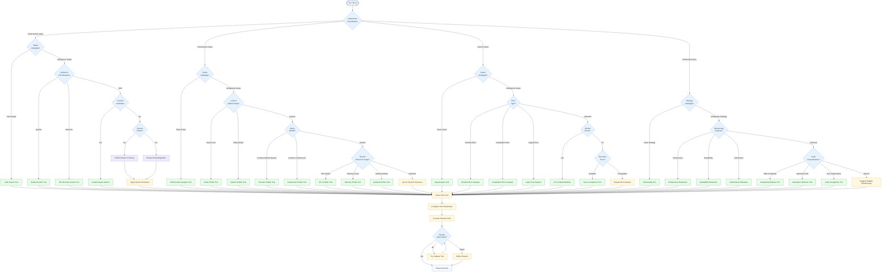

```mermaid
flowchart TD
    Start([User Query]) --> Intent{Initial Intent\nClassification}
    
    Intent -->|Code Search Intent| AmbiguousTarget{Target\nAmbiguity?}
    Intent -->|Performance Intent| AmbiguousScope{Scope\nAmbiguity?}
    Intent -->|Bug Fix Intent| AmbiguousCause{Cause\nAmbiguity?}
    Intent -->|Refactoring Intent| AmbiguousStrategy{Strategy\nAmbiguity?}
    
    %% Code Search Branch
    AmbiguousTarget -->|Clear Target| CodeSearchTool[Code Search Tool]
    AmbiguousTarget -->|Ambiguous Target| TargetClarification{Symbol or\nFile Structure?}
    
    TargetClarification -->|Symbol| SymbolSearch[Symbol Search Tool]
    TargetClarification -->|Structure| FileSearch[File Structure Search Tool]
    TargetClarification -->|Both| ContentAndContext{Context\nAvailable?}
    
    ContentAndContext -->|Yes| ContextBasedSearch[Context-Aware Search]
    ContentAndContext -->|No| UseHistory{Recent\nHistory?}
    
    UseHistory -->|Yes| HistoryBasedPrediction[Predict Based on History]
    UseHistory -->|No| DisambiguateQuery[Request Disambiguation]
    HistoryBasedPrediction --> ApplyHeuristics[Apply Search Heuristics]
    DisambiguateQuery --> ApplyHeuristics
    
    %% Performance Intent Branch  
    AmbiguousScope -->|Clear Scope| PerformanceAnalyzer[Performance Analyzer Tool]
    AmbiguousScope -->|Ambiguous Scope| ScopeEvaluation{Local or\nGlobal Scope?}
    
    ScopeEvaluation -->|Likely Local| CodeProfiler[Code Profiler Tool]
    ScopeEvaluation -->|Likely Global| SystemProfiler[System Profiler Tool]
    ScopeEvaluation -->|Unclear| ExamineDetails{Query\nDetails?}
    
    ExamineDetails -->|Contains Method Names| FunctionProfiler[Function Profiler Tool]
    ExamineDetails -->|Contains Components| ComponentProfiler[Component Profiler Tool]
    ExamineDetails -->|Generic| ResourceUsage{Recent\nResource Usage?}
    
    ResourceUsage -->|CPU Spikes| CPUProfiler[CPU Profiler Tool]
    ResourceUsage -->|Memory Issues| MemoryProfiler[Memory Profiler Tool]
    ResourceUsage -->|Network Activity| NetworkProfiler[Network Profiler Tool]
    ResourceUsage -->|Unknown| AskForSpecifics[Ask for Specific Resource]
    
    %% Bug Fix Intent Branch
    AmbiguousCause -->|Clear Cause| BugAnalyzer[Bug Analyzer Tool]
    AmbiguousCause -->|Ambiguous Cause| ErrorTypeEvaluation{Error\nType?}
    
    ErrorTypeEvaluation -->|Runtime Error| RuntimeAnalyzer[Runtime Error Analyzer]
    ErrorTypeEvaluation -->|Compilation Error| CompilationAnalyzer[Compilation Error Analyzer]
    ErrorTypeEvaluation -->|Logical Error| LogicAnalyzer[Logic Flow Analyzer]
    ErrorTypeEvaluation -->|Unknown| ErrorPatternSearch{Similar\nErrors?}
    
    ErrorPatternSearch -->|Yes| PatternMatcher[Error Pattern Matcher]
    ErrorPatternSearch -->|No| TraceDifference{Execution\nTrace?}
    
    TraceDifference -->|Available| TraceComparer[Trace Comparison Tool]
    TraceDifference -->|Unavailable| RequestErrorDetails[Request Error Details]
    
    %% Refactoring Intent Branch
    AmbiguousStrategy -->|Clear Strategy| RefactoringTool[Refactoring Tool]
    AmbiguousStrategy -->|Ambiguous Strategy| PurposeEvaluation{Refactoring\nPurpose?}
    
    PurposeEvaluation -->|Performance| PerformanceRefactorer[Performance Refactorer]
    PurposeEvaluation -->|Readability| ReadabilityRefactorer[Readability Refactorer]
    PurposeEvaluation -->|Architecture| ArchitectureRefactorer[Architecture Refactorer]
    PurposeEvaluation -->|Unknown| CodeEvaluation{Code\nCharacteristics?}
    
    CodeEvaluation -->|High Complexity| ComplexityReducer[Complexity Reducer Tool]
    CodeEvaluation -->|Duplicate Code| DuplicationRemover[Duplication Remover Tool]
    CodeEvaluation -->|Poor Organization| CodeReorganizer[Code Reorganizer Tool]
    CodeEvaluation -->|Generic| SuggestRefactorings[Suggest Multiple Refactorings]
    
    %% Tool Selection Resolution
    CodeSearchTool --> ToolSelection[Select Final Tool]
    SymbolSearch --> ToolSelection
    FileSearch --> ToolSelection
    ContextBasedSearch --> ToolSelection
    ApplyHeuristics --> ToolSelection
    
    PerformanceAnalyzer --> ToolSelection
    CodeProfiler --> ToolSelection
    SystemProfiler --> ToolSelection
    FunctionProfiler --> ToolSelection
    ComponentProfiler --> ToolSelection
    CPUProfiler --> ToolSelection
    MemoryProfiler --> ToolSelection
    NetworkProfiler --> ToolSelection
    AskForSpecifics --> ToolSelection
    
    BugAnalyzer --> ToolSelection
    RuntimeAnalyzer --> ToolSelection
    CompilationAnalyzer --> ToolSelection
    LogicAnalyzer --> ToolSelection
    PatternMatcher --> ToolSelection
    TraceComparer --> ToolSelection
    RequestErrorDetails --> ToolSelection
    
    RefactoringTool --> ToolSelection
    PerformanceRefactorer --> ToolSelection
    ReadabilityRefactorer --> ToolSelection
    ArchitectureRefactorer --> ToolSelection
    ComplexityReducer --> ToolSelection
    DuplicationRemover --> ToolSelection
    CodeReorganizer --> ToolSelection
    SuggestRefactorings --> ToolSelection
    
    ToolSelection --> ConfigureParameters[Configure Tool Parameters]
    ConfigureParameters --> ExecuteTool[Execute Selected Tool]
    ExecuteTool --> EvaluateResults{Results\nMeet Intent?}
    
    EvaluateResults -->|Yes| Present[Present Results]
    EvaluateResults -->|Partial| Refine[Refine Results]
    EvaluateResults -->|No| Fallback[Try Fallback Tool]
    
    Refine --> Present
    Fallback --> EvaluateResults
    
    class Start,Present endpoint;
    class Intent,AmbiguousTarget,AmbiguousScope,AmbiguousCause,AmbiguousStrategy,TargetClarification,ContentAndContext,UseHistory,ScopeEvaluation,ExamineDetails,ResourceUsage,ErrorTypeEvaluation,ErrorPatternSearch,TraceDifference,PurposeEvaluation,CodeEvaluation,EvaluateResults decision;
    
    classDef endpoint fill:#f8f9fa,stroke:#4285f4,stroke-width:2px,stroke-dasharray: 5 5;
    classDef decision fill:#e6f3ff,stroke:#4285f4,stroke-width:1px;
    classDef tool fill:#e6ffe6,stroke:#0f9d58,stroke-width:1px;
    classDef process fill:#fff8e1,stroke:#ffa000,stroke-width:1px;
    
    class CodeSearchTool,SymbolSearch,FileSearch,ContextBasedSearch,PerformanceAnalyzer,CodeProfiler,SystemProfiler,FunctionProfiler,ComponentProfiler,CPUProfiler,MemoryProfiler,NetworkProfiler,BugAnalyzer,RuntimeAnalyzer,CompilationAnalyzer,LogicAnalyzer,PatternMatcher,TraceComparer,RefactoringTool,PerformanceRefactorer,ReadabilityRefactorer,ArchitectureRefactorer,ComplexityReducer,DuplicationRemover,CodeReorganizer tool;
    
    class ApplyHeuristics,AskForSpecifics,RequestErrorDetails,SuggestRefactorings,ToolSelection,ConfigureParameters,ExecuteTool,Refine,Fallback process;
``` 