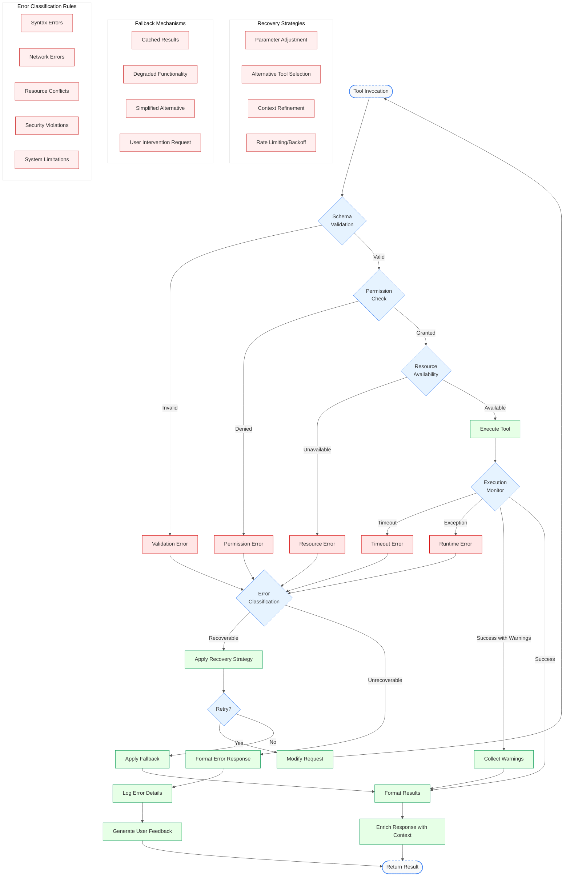

```mermaid
%%{init: {'theme': 'base', 'themeVariables': { 'primaryColor': '#ffefef', 'primaryTextColor': '#333', 'primaryBorderColor': '#c22', 'lineColor': '#555', 'secondaryColor': '#f4f4f4', 'tertiaryColor': '#fff' }}}%%
flowchart TB
    Start([Tool Invocation]) --> RequestValidation{Schema\nValidation}
    
    RequestValidation -->|Invalid| ValidationError[Validation Error]
    ValidationError --> ErrorClassifier
    
    RequestValidation -->|Valid| PermissionCheck{Permission\nCheck}
    
    PermissionCheck -->|Denied| PermissionError[Permission Error]
    PermissionError --> ErrorClassifier
    
    PermissionCheck -->|Granted| ResourceCheck{Resource\nAvailability}
    
    ResourceCheck -->|Unavailable| ResourceError[Resource Error]
    ResourceError --> ErrorClassifier
    
    ResourceCheck -->|Available| ToolExecution[Execute Tool]
    
    ToolExecution --> ExecutionMonitor{Execution\nMonitor}
    
    ExecutionMonitor -->|Timeout| TimeoutError[Timeout Error]
    TimeoutError --> ErrorClassifier
    
    ExecutionMonitor -->|Exception| RuntimeError[Runtime Error]
    RuntimeError --> ErrorClassifier
    
    ExecutionMonitor -->|Success with Warnings| WarningCollector[Collect Warnings]
    WarningCollector --> ResultFormatter
    
    ExecutionMonitor -->|Success| ResultFormatter[Format Results]
    
    ErrorClassifier{Error\nClassification}
    ErrorClassifier -->|Recoverable| RecoveryStrategy[Apply Recovery Strategy]
    RecoveryStrategy --> RetryDecision{Retry?}
    
    RetryDecision -->|Yes| RetryWithModification[Modify Request]
    RetryWithModification --> Start
    
    RetryDecision -->|No| FallbackStrategy[Apply Fallback]
    FallbackStrategy --> ResultFormatter
    
    ErrorClassifier -->|Unrecoverable| ErrorFormatter[Format Error Response]
    ErrorFormatter --> ErrorLogger[Log Error Details]
    ErrorLogger --> UserFeedback[Generate User Feedback]
    
    ResultFormatter --> ResponseEnricher[Enrich Response with Context]
    ResponseEnricher --> End([Return Result])
    
    UserFeedback --> End
    
    subgraph Recovery Strategies
        RecoveryStrategyA[Parameter Adjustment]
        RecoveryStrategyB[Alternative Tool Selection]
        RecoveryStrategyC[Context Refinement]
        RecoveryStrategyD[Rate Limiting/Backoff]
    end
    
    subgraph Fallback Mechanisms
        FallbackA[Cached Results]
        FallbackB[Degraded Functionality]
        FallbackC[Simplified Alternative]
        FallbackD[User Intervention Request]
    end
    
    subgraph Error Classification Rules
        ErrorClass1[Syntax Errors]
        ErrorClass2[Network Errors]
        ErrorClass3[Resource Conflicts]
        ErrorClass4[Security Violations]
        ErrorClass5[System Limitations]
    end
    
    class RecoveryStrategies,FallbackMechanisms,ErrorClassificationRules subdomain;
    
    classDef subdomain fill:#f9f9f9,stroke:#999,stroke-width:1px;
    classDef decision fill:#e6f3ff,stroke:#4285f4,stroke-width:1px;
    classDef error fill:#ffe6e6,stroke:#d50000,stroke-width:1px;
    classDef process fill:#e6ffe6,stroke:#0f9d58,stroke-width:1px;
    classDef endpoint fill:#f8f9fa,stroke:#4285f4,stroke-width:2px,stroke-dasharray: 5 5;
    
    class Start,End endpoint;
    class RequestValidation,PermissionCheck,ResourceCheck,ExecutionMonitor,RetryDecision,ErrorClassifier decision;
    class ValidationError,PermissionError,ResourceError,TimeoutError,RuntimeError error;
    class ToolExecution,ResultFormatter,ResponseEnricher,WarningCollector,RecoveryStrategy,FallbackStrategy,ErrorFormatter,ErrorLogger,UserFeedback,RetryWithModification process;
``` 