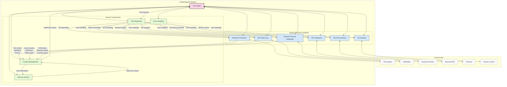

```mermaid
graph TB
    subgraph "Environment"
        FS[File System]
        IDE[IDE/Editor]
        Browser[Browser Preview]
        APIs[External APIs]
        Terminal[Terminal]
        Git[Version Control]
    end
    
    subgraph "Unified Agentic System"
        Core[Core Agent]
        subgraph "System Resource Interface"
            FSI[Filesystem Interface]
            IDES[IDE State Sync]
            BPI[Browser Preview Integration]
            APII[API Integration]
            TermI[Terminal Interface]
            GitI[Git Interface]
        end
        
        subgraph "Internal Components"
            contextMgmt[Context Management]
            toolDispatch[Tool Dispatcher]
            memory[Memory System]
            errorHandler[Error Handling]
        end
    end
    
    %% Connections between interface and environment
    FSI <--> FS
    IDES <--> IDE
    BPI <--> Browser
    APII <--> APIs
    TermI <--> Terminal
    GitI <--> Git
    
    %% Internal connections
    Core <--> FSI
    Core <--> IDES
    Core <--> BPI
    Core <--> APII
    Core <--> TermI
    Core <--> GitI
    
    Core <--> contextMgmt
    Core <--> toolDispatch
    Core <--> memory
    Core <--> errorHandler
    
    %% Data flows
    FSI -- "File content\nMetadata\nEvents" --> contextMgmt
    IDES -- "Cursor position\nSelections\nEditor state" --> contextMgmt
    BPI -- "DOM data\nNetwork activity\nConsole output" --> contextMgmt
    
    contextMgmt -- "Retrieved context" --> Core
    Core -- "Tool requests" --> toolDispatch
    toolDispatch -- "File operations" --> FSI
    toolDispatch -- "Editor commands" --> IDES
    toolDispatch -- "Browser actions" --> BPI
    toolDispatch -- "API requests" --> APII
    toolDispatch -- "Terminal commands" --> TermI
    toolDispatch -- "Version control" --> GitI
    
    memory -- "Historical context" --> contextMgmt
    contextMgmt -- "New information" --> memory
    
    errorHandler -. "Error handling" .-> FSI
    errorHandler -. "Error handling" .-> IDES
    errorHandler -. "Error handling" .-> BPI
    errorHandler -. "Error handling" .-> APII
    errorHandler -. "Error handling" .-> TermI
    errorHandler -. "Error handling" .-> GitI
    
    classDef envSystems fill:#f9f9f9,stroke:#999,stroke-width:1px
    classDef interfaces fill:#d5e8f9,stroke:#333,stroke-width:1px
    classDef core fill:#f9d5e5,stroke:#333,stroke-width:2px
    classDef internal fill:#e5f9d5,stroke:#333,stroke-width:1px
    
    class FS,IDE,Browser,APIs,Terminal,Git envSystems
    class FSI,IDES,BPI,APII,TermI,GitI interfaces
    class Core core
    class contextMgmt,toolDispatch,memory,errorHandler internal
``` 