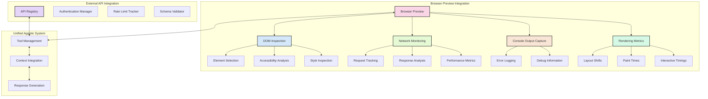

```mermaid
graph TD
    subgraph "Browser Preview Integration"
        A[Browser Preview] --> B[DOM Inspection]
        A --> C[Network Monitoring]
        A --> D[Console Output Capture]
        A --> E[Rendering Metrics]
        
        B --> F[Element Selection]
        B --> G[Accessibility Analysis]
        B --> H[Style Inspection]
        
        C --> I[Request Tracking]
        C --> J[Response Analysis]
        C --> K[Performance Metrics]
        
        D --> L[Error Logging]
        D --> M[Debug Information]
        
        E --> N[Layout Shifts]
        E --> O[Paint Times]
        E --> P[Interactive Timings]
    end
    
    subgraph "External API Integration"
        Q[API Registry]
        R[Authentication Manager]
        S[Rate Limit Tracker]
        T[Schema Validator]
    end
    
    subgraph "Unified Agentic System"
        U[Tool Management]
        V[Context Integration]
        W[Response Generation]
    end
    
    A <--> U
    Q <--> U
    U <--> V
    V <--> W
    
    style A fill:#f9d5e5,stroke:#333,stroke-width:2px
    style B fill:#d5e8f9,stroke:#333,stroke-width:2px
    style C fill:#e5f9d5,stroke:#333,stroke-width:2px
    style D fill:#f9e5d5,stroke:#333,stroke-width:2px
    style E fill:#d5f9e5,stroke:#333,stroke-width:2px
    style Q fill:#e5d5f9,stroke:#333,stroke-width:2px
``` 