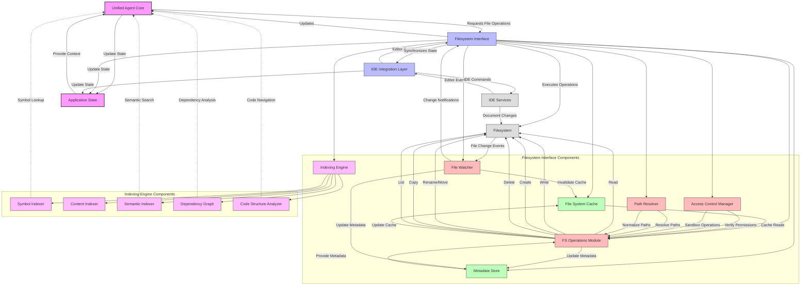

```mermaid
graph TD
    %% Main Components
    Agent[Unified Agent Core]
    FSI[Filesystem Interface]
    IDE[IDE Integration Layer]
    FS[Filesystem]
    IDEServ[IDE Services]
    AppState[Application State]

    %% Filesystem Interface Components
    subgraph "Filesystem Interface Components"
        IndexEngine[Indexing Engine]
        FileWatcher[File Watcher]
        AccessManager[Access Control Manager]
        PathResolver[Path Resolver]
        FSOperations[FS Operations Module]
        FSCache[File System Cache]
        MetadataStore[Metadata Store]
    end

    %% Indexing Engine Components
    subgraph "Indexing Engine Components"
        SymbolIndexer[Symbol Indexer]
        ContentIndexer[Content Indexer]
        SemanticIndexer[Semantic Indexer]
        DependencyGraph[Dependency Graph]
        CodeStructure[Code Structure Analyzer]
    end

    %% Access Paths
    Agent -->|"Requests File Operations"| FSI
    FSI -->|"Executes Operations"| FS
    FS -->|"File Change Events"| FileWatcher
    FileWatcher -->|"Change Notifications"| FSI
    FSI -->|"Updates"| Agent
    
    IDE -->|"Editor Events"| FSI
    FSI -->|"Synchronizes State"| IDE
    
    %% Filesystem Interface Internal Connections
    FSI --> IndexEngine
    FSI --> FileWatcher
    FSI --> AccessManager
    FSI --> PathResolver
    FSI --> FSOperations
    FSI --> FSCache
    FSI --> MetadataStore
    
    %% Indexing Engine Internal Connections
    IndexEngine --> SymbolIndexer
    IndexEngine --> ContentIndexer
    IndexEngine --> SemanticIndexer
    IndexEngine --> DependencyGraph
    IndexEngine --> CodeStructure
    
    %% Filesystem Operations
    FSOperations -->|"Read"| FS
    FSOperations -->|"Write"| FS
    FSOperations -->|"Create"| FS
    FSOperations -->|"Delete"| FS
    FSOperations -->|"Rename/Move"| FS
    FSOperations -->|"Copy"| FS
    FSOperations -->|"List"| FS
    
    %% Cache Operations
    FSCache -->|"Cache Reads"| FSOperations
    FSOperations -->|"Update Cache"| FSCache
    FileWatcher -->|"Invalidate Cache"| FSCache
    
    %% Access Control
    AccessManager -->|"Verify Permissions"| FSOperations
    AccessManager -->|"Sandbox Operations"| FSOperations
    
    %% Path Resolution
    PathResolver -->|"Resolve Paths"| FSOperations
    PathResolver -->|"Normalize Paths"| FSOperations
    
    %% Metadata Management
    MetadataStore -->|"Provide Metadata"| FSOperations
    FSOperations -->|"Update Metadata"| MetadataStore
    FileWatcher -->|"Update Metadata"| MetadataStore
    
    %% IDE Integration
    IDEServ -->|"Editor Events"| IDE
    IDE -->|"IDE Commands"| IDEServ
    IDEServ -->|"Document Changes"| FS
    
    %% Application State
    Agent -->|"Update State"| AppState
    AppState -->|"Provide Context"| Agent
    FSI -->|"Update State"| AppState
    IDE -->|"Update State"| AppState

    %% Special Data Flows
    SymbolIndexer -.->|"Symbol Lookup"| Agent
    SemanticIndexer -.->|"Semantic Search"| Agent
    DependencyGraph -.->|"Dependency Analysis"| Agent
    CodeStructure -.->|"Code Navigation"| Agent
    
    %% Styling
    classDef core fill:#f9f,stroke:#333,stroke-width:2px;
    classDef interface fill:#bbf,stroke:#333,stroke-width:1px;
    classDef storage fill:#bfb,stroke:#333,stroke-width:1px;
    classDef indexing fill:#fbf,stroke:#333,stroke-width:1px;
    classDef external fill:#ddd,stroke:#333,stroke-width:1px;
    classDef component fill:#fbb,stroke:#333,stroke-width:1px;

    class Agent,AppState core;
    class FSI,IDE interface;
    class FSCache,MetadataStore storage;
    class IndexEngine,SymbolIndexer,ContentIndexer,SemanticIndexer,DependencyGraph,CodeStructure indexing;
    class FS,IDEServ external;
    class FileWatcher,AccessManager,PathResolver,FSOperations component;
``` 