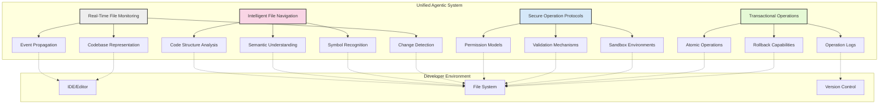

```mermaid
graph TD
    subgraph "Unified Agentic System"
        A[Intelligent File Navigation] --> B[Code Structure Analysis]
        A --> C[Semantic Understanding]
        A --> D[Symbol Recognition]
        
        E[Real-Time File Monitoring] --> F[Change Detection]
        E --> G[Event Propagation]
        E --> H[Codebase Representation]
        
        I[Secure Operation Protocols] --> J[Permission Models]
        I --> K[Validation Mechanisms]
        I --> L[Sandbox Environments]
        
        M[Transactional Operations] --> N[Atomic Operations]
        M --> O[Rollback Capabilities]
        M --> P[Operation Logs]
    end
    
    subgraph "Developer Environment"
        Q[IDE/Editor]
        R[File System]
        S[Version Control]
    end
    
    B -.-> R
    C -.-> R
    D -.-> R
    F -.-> R
    G -.-> Q
    H -.-> Q
    J -.-> R
    K -.-> R
    L -.-> R
    N -.-> R
    O -.-> R
    P -.-> S
    
    style A fill:#f9d5e5,stroke:#333,stroke-width:2px
    style E fill:#eeeeee,stroke:#333,stroke-width:2px
    style I fill:#d5e8f9,stroke:#333,stroke-width:2px
    style M fill:#e5f9d5,stroke:#333,stroke-width:2px
``` 