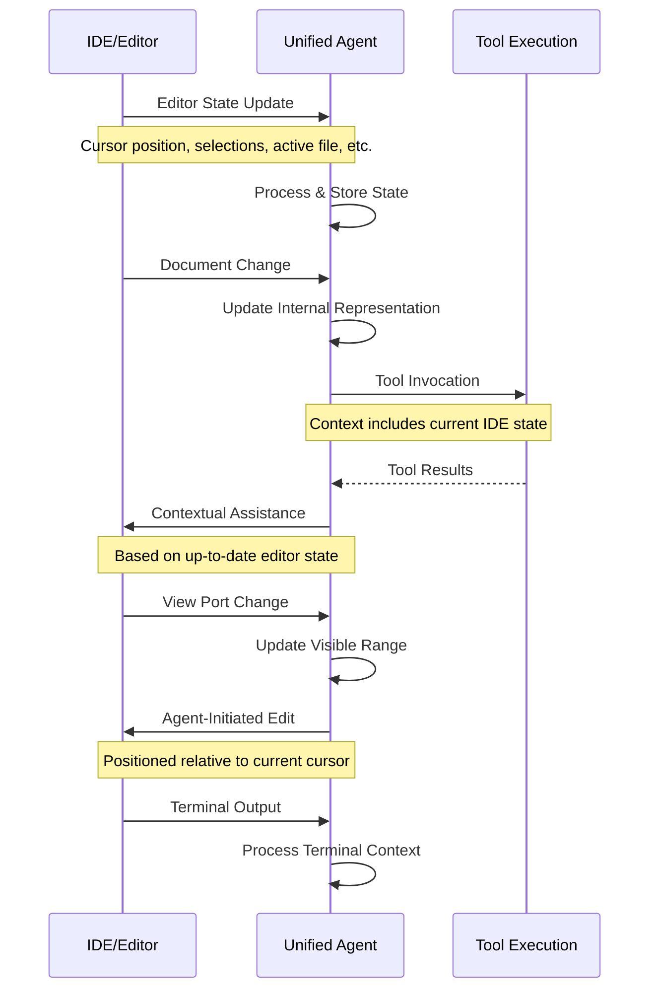

```mermaid
sequenceDiagram
    participant IDE as IDE/Editor
    participant Agent as Unified Agent
    participant Tools as Tool Execution
    
    IDE->>Agent: Editor State Update
    Note over IDE,Agent: Cursor position, selections, active file, etc.
    
    Agent->>Agent: Process & Store State
    
    IDE->>Agent: Document Change
    Agent->>Agent: Update Internal Representation
    
    Agent->>Tools: Tool Invocation
    Note over Agent,Tools: Context includes current IDE state
    
    Tools-->>Agent: Tool Results
    
    Agent->>IDE: Contextual Assistance
    Note over Agent,IDE: Based on up-to-date editor state
    
    IDE->>Agent: View Port Change
    Agent->>Agent: Update Visible Range
    
    Agent->>IDE: Agent-Initiated Edit
    Note over Agent,IDE: Positioned relative to current cursor
    
    IDE->>Agent: Terminal Output
    Agent->>Agent: Process Terminal Context
``` 