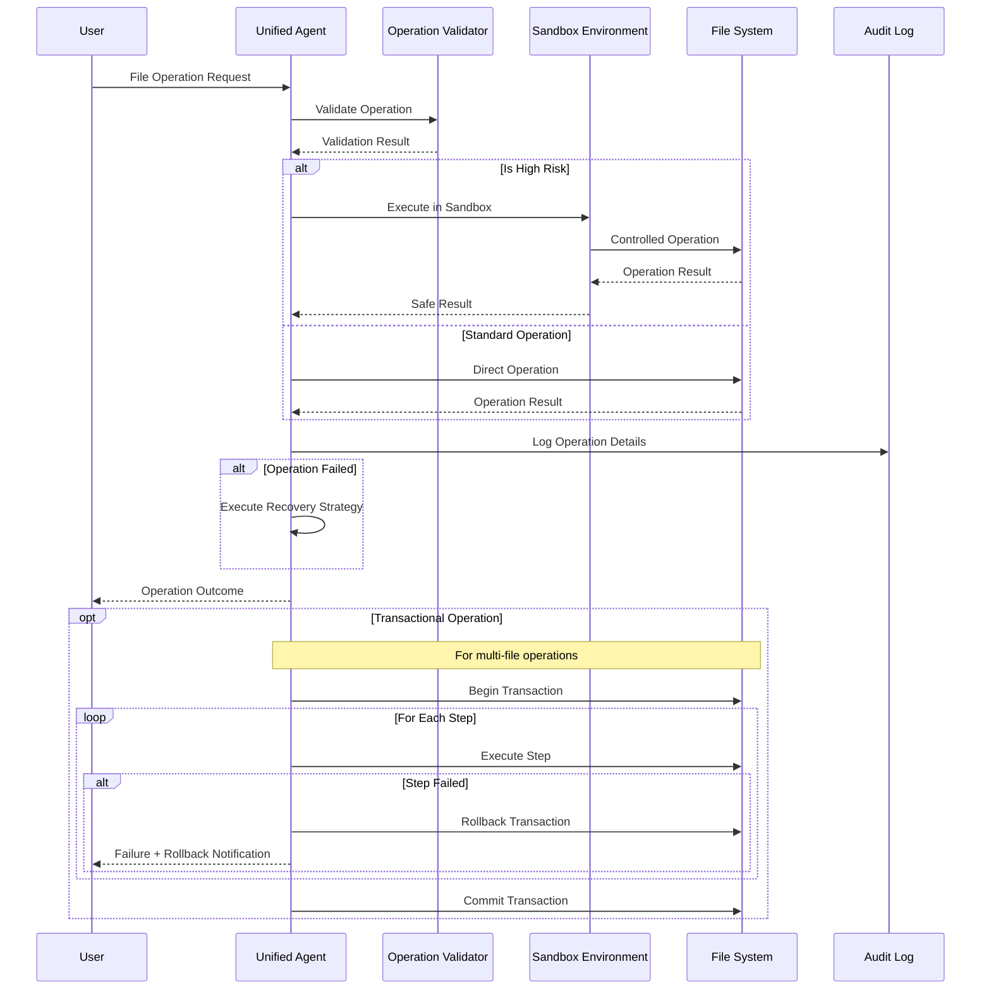

```mermaid
sequenceDiagram
    participant User
    participant Agent as Unified Agent
    participant Validator as Operation Validator
    participant Sandbox as Sandbox Environment
    participant FS as File System
    participant Audit as Audit Log
    
    User->>Agent: File Operation Request
    
    Agent->>Validator: Validate Operation
    Validator-->>Agent: Validation Result
    
    alt Is High Risk
        Agent->>Sandbox: Execute in Sandbox
        Sandbox->>FS: Controlled Operation
        FS-->>Sandbox: Operation Result
        Sandbox-->>Agent: Safe Result
    else Standard Operation
        Agent->>FS: Direct Operation
        FS-->>Agent: Operation Result
    end
    
    Agent->>Audit: Log Operation Details
    
    alt Operation Failed
        Agent->>Agent: Execute Recovery Strategy
    end
    
    Agent-->>User: Operation Outcome
    
    opt Transactional Operation
        Note over Agent,FS: For multi-file operations
        Agent->>FS: Begin Transaction
        loop For Each Step
            Agent->>FS: Execute Step
            alt Step Failed
                Agent->>FS: Rollback Transaction
                Agent-->>User: Failure + Rollback Notification
            end
        end
        Agent->>FS: Commit Transaction
    end
``` 