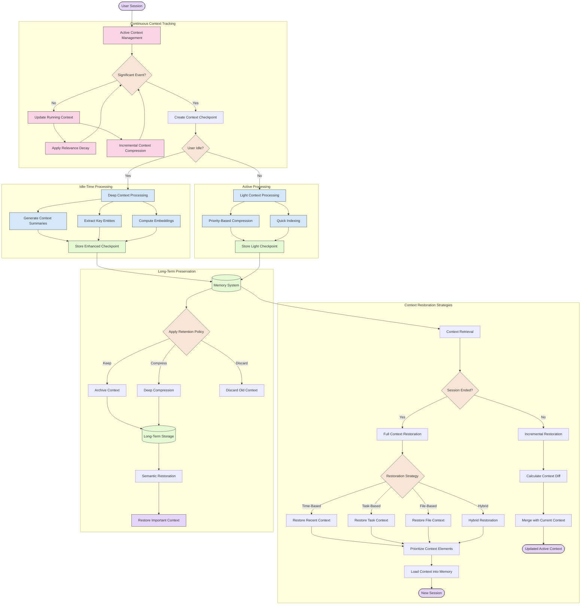

```mermaid
flowchart TD
    Start([User Session]) --> Active[Active Context Management]
    
    subgraph "Continuous Context Tracking"
        Active --> Events{Significant Event?}
        Events -->|Yes| CreateCheckpoint[Create Context Checkpoint]
        Events -->|No| UpdateContinuous[Update Running Context]
        
        UpdateContinuous --> Decay[Apply Relevance Decay]
        UpdateContinuous --> Compress[Incremental Context Compression]
        
        CreateCheckpoint --> IdleCheck{User Idle?}
        Compress --> Events
        Decay --> Events
    end
    
    IdleCheck -->|Yes| DeepProcess[Deep Context Processing]
    IdleCheck -->|No| LightProcess[Light Context Processing]
    
    subgraph "Idle-Time Processing"
        DeepProcess --> Summarize[Generate Context Summaries]
        DeepProcess --> Extract[Extract Key Entities]
        DeepProcess --> Embed[Compute Embeddings]
        
        Summarize --> StoreCheckpoint[Store Enhanced Checkpoint]
        Extract --> StoreCheckpoint
        Embed --> StoreCheckpoint
    end
    
    subgraph "Active Processing"
        LightProcess --> PriorityCompress[Priority-Based Compression]
        LightProcess --> QuickIndex[Quick Indexing]
        
        PriorityCompress --> FastStore[Store Light Checkpoint]
        QuickIndex --> FastStore
    end
    
    StoreCheckpoint --> MemorySystem[(Memory System)]
    FastStore --> MemorySystem
    
    MemorySystem --> ContextRetrieval[Context Retrieval]
    
    subgraph "Context Restoration Strategies"
        ContextRetrieval --> SessionEnd{Session Ended?}
        
        SessionEnd -->|Yes| FullRestore[Full Context Restoration]
        SessionEnd -->|No| IncrementalRestore[Incremental Restoration]
        
        FullRestore --> Strategy{Restoration Strategy}
        
        Strategy -->|Time-Based| RestoreRecent[Restore Recent Context]
        Strategy -->|Task-Based| RestoreTask[Restore Task Context]
        Strategy -->|File-Based| RestoreFiles[Restore File Context]
        Strategy -->|Hybrid| RestoreHybrid[Hybrid Restoration]
        
        RestoreRecent --> Prioritize[Prioritize Context Elements]
        RestoreTask --> Prioritize
        RestoreFiles --> Prioritize
        RestoreHybrid --> Prioritize
        
        Prioritize --> Load[Load Context into Memory]
        Load --> NewSession([New Session])
        
        IncrementalRestore --> DiffContext[Calculate Context Diff]
        DiffContext --> MergeContext[Merge with Current Context]
        MergeContext --> ActiveContext([Updated Active Context])
    end
    
    subgraph "Long-Term Preservation"
        MemorySystem --> RetentionPolicy{Apply Retention Policy}
        
        RetentionPolicy -->|Keep| ArchiveContext[Archive Context]
        RetentionPolicy -->|Compress| CompressContext[Deep Compression]
        RetentionPolicy -->|Discard| DiscardContext[Discard Old Context]
        
        ArchiveContext --> LongTermStore[(Long-Term Storage)]
        CompressContext --> LongTermStore
        
        LongTermStore --> SemanticRestore[Semantic Restoration]
        SemanticRestore --> ImportantContext[Restore Important Context]
    end
    
    classDef active fill:#f9d5e5,stroke:#333,stroke-width:1px
    classDef processing fill:#d5e8f9,stroke:#333,stroke-width:1px
    classDef storage fill:#e5f9d5,stroke:#333,stroke-width:1px
    classDef decision fill:#f9e5d5,stroke:#333,stroke-width:1px
    classDef terminal fill:#e5d5f9,stroke:#333,stroke-width:1px
    
    class Active,UpdateContinuous,Compress,Decay active
    class DeepProcess,LightProcess,Summarize,Extract,Embed,PriorityCompress,QuickIndex processing
    class MemorySystem,StoreCheckpoint,FastStore,LongTermStore storage
    class Events,IdleCheck,SessionEnd,Strategy,RetentionPolicy decision
    class Start,NewSession,ActiveContext,ImportantContext terminal
``` 