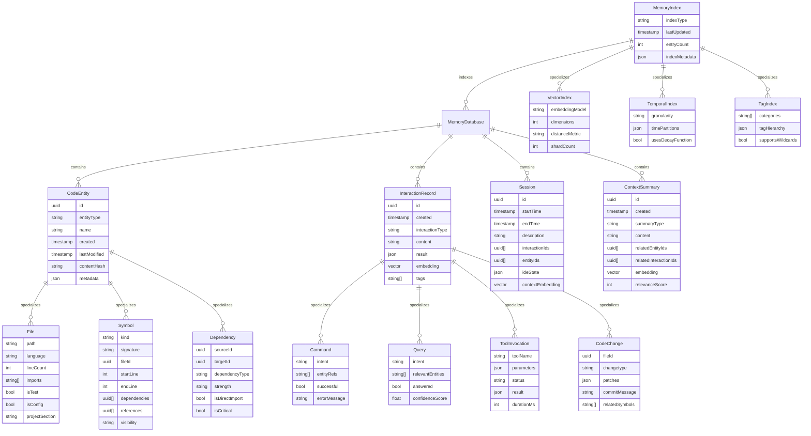

```mermaid
erDiagram
    MemoryDatabase ||--o{ CodeEntity : contains
    MemoryDatabase ||--o{ InteractionRecord : contains
    MemoryDatabase ||--o{ Session : contains
    MemoryDatabase ||--o{ ContextSummary : contains
    
    CodeEntity {
        uuid id
        string entityType
        string name
        timestamp created
        timestamp lastModified
        string contentHash
        json metadata
    }
    
    CodeEntity ||--o{ File : specializes
    CodeEntity ||--o{ Symbol : specializes
    CodeEntity ||--o{ Dependency : specializes
    
    File {
        string path
        string language
        int lineCount
        string[] imports
        bool isTest
        bool isConfig
        string projectSection
    }
    
    Symbol {
        string kind
        string signature
        uuid fileId
        int startLine
        int endLine
        uuid[] dependencies
        uuid[] references
        string visibility
    }
    
    Dependency {
        uuid sourceId
        uuid targetId
        string dependencyType
        string strength
        bool isDirectImport
        bool isCritical
    }
    
    InteractionRecord {
        uuid id
        timestamp created
        string interactionType
        string content
        json result
        vector embedding
        string[] tags
    }
    
    InteractionRecord ||--o{ Command : specializes
    InteractionRecord ||--o{ Query : specializes
    InteractionRecord ||--o{ ToolInvocation : specializes
    InteractionRecord ||--o{ CodeChange : specializes
    
    Command {
        string intent
        string[] entityRefs
        bool successful
        string errorMessage
    }
    
    Query {
        string intent
        string[] relevantEntities
        bool answered
        float confidenceScore
    }
    
    ToolInvocation {
        string toolName
        json parameters
        string status
        json result
        int durationMs
    }
    
    CodeChange {
        uuid fileId
        string changetype
        json patches
        string commitMessage
        string[] relatedSymbols
    }
    
    Session {
        uuid id
        timestamp startTime
        timestamp endTime
        string description
        uuid[] interactionIds
        uuid[] entityIds
        json ideState
        vector contextEmbedding
    }
    
    ContextSummary {
        uuid id
        timestamp created
        string summaryType
        string content
        uuid[] relatedEntityIds
        uuid[] relatedInteractionIds
        vector embedding
        int relevanceScore
    }
    
    MemoryIndex ||--o{ MemoryDatabase : indexes
    
    MemoryIndex {
        string indexType
        timestamp lastUpdated
        int entryCount
        json indexMetadata
    }
    
    MemoryIndex ||--o{ VectorIndex : specializes
    MemoryIndex ||--o{ TemporalIndex : specializes
    MemoryIndex ||--o{ TagIndex : specializes
    
    VectorIndex {
        string embeddingModel
        int dimensions
        string distanceMetric
        int shardCount
    }
    
    TemporalIndex {
        string granularity
        json timePartitions
        bool usesDecayFunction
    }
    
    TagIndex {
        string[] categories
        json tagHierarchy
        bool supportsWildcards
    }
``` 